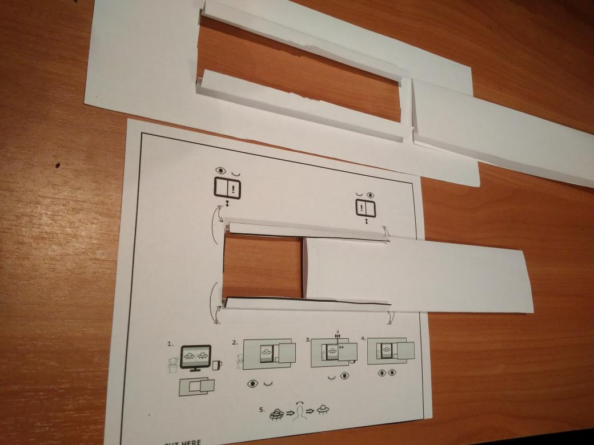
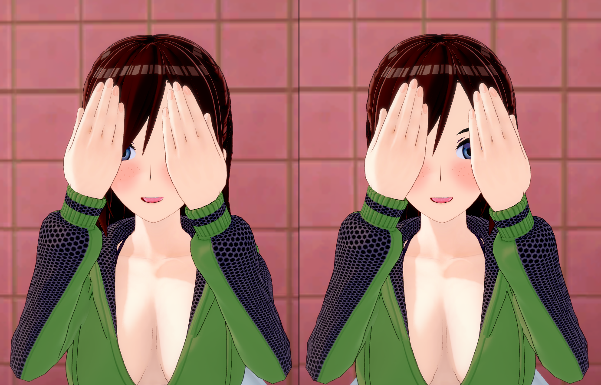

# What is X3D and how to view it just on your screen

An X3D stereo pair is a R L stereo pair (the right image is for the left eye), sometimes called a cross-view stereo pair.

It is possible to view X3D stereo images without glasses.
(In case of discomfort: the distance is wrong, find a comfortable distance)

There are 3 tutorials:

- Video: "[Learn how to view upcoming images in 3D without using ANY special GLASSES!](https://www.youtube.com/watch?v=hxTMlDijDlU) 
I would advise all to do this on nothing smaller than a laptop screen. Especially when learning. Bigger is usually Better."

- ["The finger method" of learning X3D viewing](https://www.whatsupinthesky.com/images/dgannett/3D_TUTORIALS/X3D.jpg)

- or read the next section to learn to view X3D with (or without) a frame

## Viewing X3D with a frame

X3D is a stereo pair where the image for the right eye is on the left.

To view an X3D, you need to conceal the right image from the right eye, and conceal the left image from the left eye.

This is how it works if you use a frame:

The frame can be made from one A4 sheet:

And this is how to use it (note that the image is followed by a text explanation):

0. Do not strain your eyes. If you want to strain your eyes, it means that you are doing something wrong, 
   and if you are doing something wrong, eye strain will not help. Instead, try to change the distance from the screen or from the frame.
1. Take the frame with two hands, the right hand takes the moving part.
2. Close the right eye. Use the frame to conceal the left image from the left eye.
3. Close the left eye. Adjust the moving part so that it conceals the right image from the right eye.
4. Open both eyes and look through the frame. To focus, sometimes you need to change the distance from you face to the frame.
5. If the images do not match vertically, tilt your head to the left and right.
6. If you feel discomfort, try to change the distance from the screen.

Or, if you are too lazy to make a frame, you may just ***conceal the right image from your right eye with your right hand:***

